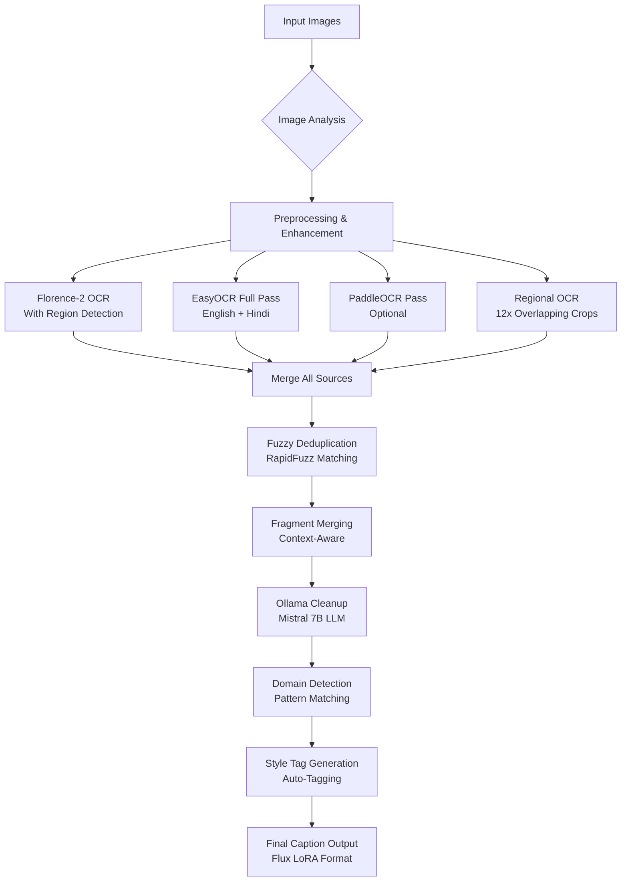
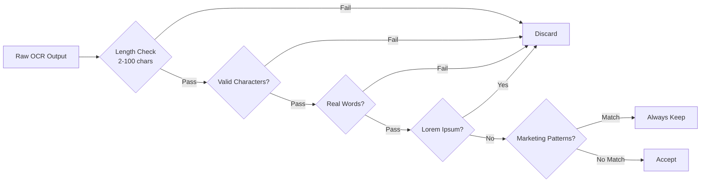
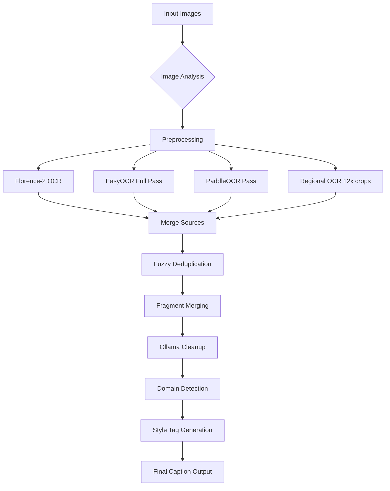
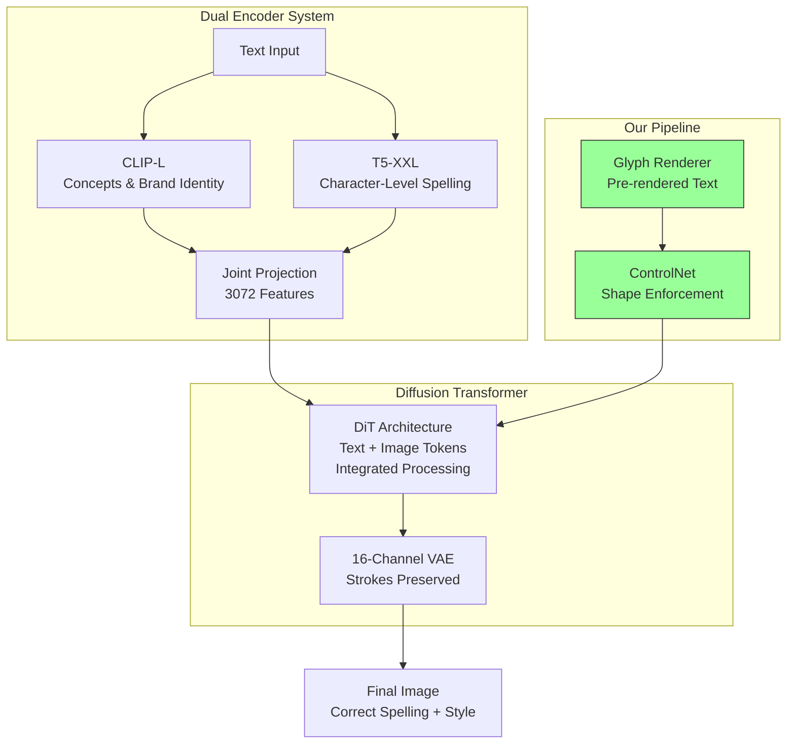
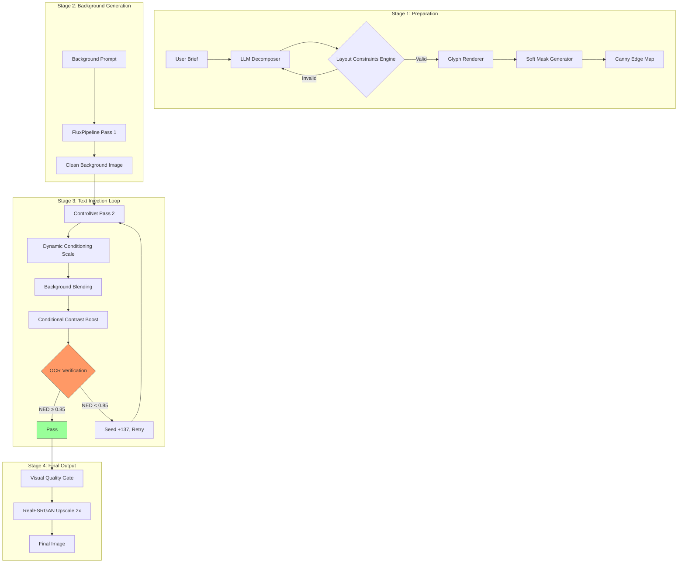

# Knowledge Transfer Document

## Animesh-Diffusion Internship Project

  

**Prepared by:** [Your Name]  

**Date:** March 2026  

**Project:** AI-Powered Poster Caption Generator & Image Generation Pipeline

  

---

  

## Table of Contents

  

1. [Project Overview](#project-overview)

2. [Project Structure](#project-structure)

3. [Core Components](#core-components)

4. [Caption Generation System](#caption-generation-system)

5. [Image Generation Pipeline: Design Evolution & Architecture](#image-generation-pipeline-design-evolution--architecture)

6. [Image Generation Pipeline: Implementation Details](#image-generation-pipeline-implementation-details)

7. [Setup & Installation](#setup--installation)

8. [Usage Guide](#usage-guide)

9. [Troubleshooting & Best Practices](#troubleshooting--best-practices)

10. [Future Improvements & Next Steps](#future-improvements--next-steps)

  

---

  

## Project Overview

  

This project consists of **two main systems**:

  

### 1. Universal Poster Caption Generator (`caption_runner.py`)

A batch processing system that generates training captions for Flux LoRA models from marketing posters and images. It uses a multi-OCR approach combined with LLM-based text cleanup to produce high-quality, structured captions.

  

**Purpose:** Create training data for fine-tuning image generation models on specific domains (wedding invitations, festival posters, sale ads, etc.)

  

### 2. AI Marketing Image Pipeline (`pipeline/scripts/`)

A two-pass Flux + ControlNet pipeline that generates marketing images from text briefs with guaranteed text readability through OCR verification.

  

**Purpose:** Generate production-ready marketing images with legible text based on plain-language descriptions.

  

---

  

## Project Structure

  

```

Animesh-Diffusion/

├── caption_runner.py          # Main caption generation script

├── caption_test.py            # Test/debug script for captioning

├── split_batches.py           # Utility to split images into batches

├── caption_progress.json      # Progress tracking (auto-generated)

├── retry_needed.txt           # Images flagged for retry (auto-generated)

├── failed_images.txt          # Failed images log (auto-generated)

│

├── batch_1/                   # Batch folders (1-67)

├── batch_2/

├── ...

├── batch_67/

│

├── models/

│   ├── flux-dev/             # Flux Dev model directory

│   ├── controlnet-union/     # InstantX ControlNet Union model

│   └── realesrgan/           # RealESRGAN x2+ upscaler weights

│

├── fonts/                     # Custom fonts for text rendering

│

├── pipeline/

│   ├── config.yaml           # Pipeline configuration

│   ├── outputs/              # Generated output images

│   └── scripts/

│       ├── pipeline_runner.py    # Main entry point

│       ├── flux_generator.py     # Flux model pipeline class

│       ├── glyph_renderer.py     # Text glyph rendering

│       ├── llm_decomposer.py     # LLM prompt decomposition

│       ├── quality_gate.py       # OCR verification

│       ├── upscale-env/        # Virtual env for upscaler

│       └── gen-env/            # Virtual env for generation

│

├── flash_attn/               # Flash attention compatibility layer

├── sv/                       # (Unknown purpose - legacy?)

└── logs/                     # Log files

```

  

---

  

## Core Components

  

### System 1: Caption Generator

  

| Component | Description |

|-----------|-------------|

| `caption_runner.py` | Main batch processing script |

| `caption_test.py` | Interactive testing/debugging tool |

| `split_batches.py` | Image organization utility |

  

**Models Used:**

- **Florence-2-base-ft** - Visual description + OCR with region detection

- **EasyOCR** - Multi-pass OCR (English + Hindi)

- **PaddleOCR** - Additional OCR source (optional)

- **Ollama Mistral 7B** - LLM-based text cleanup and correction

  

### System 2: Image Generation Pipeline

  

| Component | Description |

|-----------|-------------|

| `pipeline_runner.py` | Main orchestration script |

| `flux_generator.py` | Two-pass Flux + ControlNet pipeline |

| `glyph_renderer.py` | Text rendering with font fallback |

| `llm_decomposer.py` | Prompt decomposition via LLM |

| `quality_gate.py` | OCR verification and contrast enhancement |

  

**Models Used:**

- **Flux Dev** - Base text-to-image model

- **ControlNet Union (InstantX)** - Text shape enforcement

- **RealESRGAN x2+** - Image upscaling

  

---

  

## Caption Generation System: Deep Technical Analysis

  

### Architecture Overview

  



  

### Multi-OCR Fusion Strategy

  

Our system uses **four parallel OCR sources** to maximize text detection coverage:

  

| OCR Source | Strengths | Weaknesses | Role in System |

|------------|-----------|------------|----------------|

| **Florence-2** | Region-aware, visual context understanding | May miss small text | Primary OCR with spatial info |

| **EasyOCR** | Fast, supports English + Hindi | Less accurate on complex fonts | Full-image pass for coverage |

| **PaddleOCR** | High accuracy on dense text | Slower, optional dependency | Additional verification source |

| **Regional OCR** | Catches tiny text in corners/edges | Computationally expensive | Final safety net for missed text |

  

### Regional OCR: The 12-Crop Strategy

  

The regional OCR processes **12 overlapping regions** to catch text that full-image passes miss:

  

```python

regions = [

    # 3x3 grid with overlap

    (0.0,  0.0,  0.5,  0.38, "top-left"),

    (0.25, 0.0,  0.75, 0.38, "top-center"),

    (0.5,  0.0,  1.0,  0.38, "top-right"),

    (0.0,  0.3,  0.5,  0.7,  "middle-left"),

    (0.25, 0.3,  0.75, 0.7,  "center"),

    (0.5,  0.3,  1.0,  0.7,  "middle-right"),

    (0.0,  0.62, 0.5,  1.0,  "bottom-left"),

    (0.25, 0.62, 0.75, 1.0,  "bottom-center"),

    (0.5,  0.62, 1.0,  1.0,  "bottom-right"),

    # Footer strips — address, phone, website, T&C

    (0.0,  0.82, 0.5,  1.0,  "footer-left"),

    (0.5,  0.82, 1.0,  1.0,  "footer-right"),

    (0.0,  0.88, 1.0,  1.0,  "bottom-strip"),

]

```

  

Each region is **4x upscaled** before OCR processing to catch tiny text that would be missed at full resolution.

  

### Text Validation Pipeline

  

Before any text is accepted, it passes through multiple validation layers:

  



  

**Validation Rules:**

1. **Length Check:** 2-100 characters (filters noise and fragments)

2. **Character Validation:** Only allows alphanumeric, Devanagari, and safe punctuation

3. **Real Word Detection:** Uses word frequency analysis to filter gibberish

4. **Lorem Ipsum Filter:** Removes placeholder text patterns

5. **Marketing Pattern Preservation:** Always keeps prices, dates, URLs, phone numbers

  

### LLM Cleanup with Ollama Mistral 7B

  

After OCR fusion and deduplication, an LLM cleans up common OCR errors:

  

**Common OCR Errors Fixed:**

| Error Type | Example | Fix |

|------------|---------|-----|

| Character confusion | "TlCKETS" → "TICKETS" | I/l/1, O/0, S/5, B/8 |

| Space errors | "TI CKETS" → "TICKETS" | Wrong splits and missing spaces |

| Unicode digits | ५ → 5 | Devanagari to ASCII conversion |

| Fragment merging | "GOLDEN SALE" from "GOLDENSALE" | Context-aware merging |

  

**Cleanup Prompt Structure:**

```

You are an OCR post-processor for ALL types of posters and designs.

Types include: marketing, wedding, festival, music concert, food menu, sports...

  

Fix these OCR text fragments:

1. TlCKETS

2. F0R 50% OFF

3. G0LDEN SALE

  

Rules:

1. Fix character confusion when result is a real word

2. Fix space errors (wrong splits and missing spaces)

3. Convert Unicode digits to ASCII

4. Keep as-is: Hindi/Devanagari text, brand names, prices, phones, URLs

5. Remove ONLY pure symbol garbage with zero real words

  

Return ONLY a valid JSON array of strings.

```

  

### Domain Detection System

  

Automatically identifies poster type using pattern matching:

  

| Domain | Keywords | Output Format |

|--------|----------|---------------|

| Wedding | wedding, bride, groom, shaadi, mehndi | "wedding invitation card design" |

| Festival | diwali, holi, navratri, eid, christmas | "festival celebration poster design" |

| Sale | sale, discount, % off, offer, deal | "sale marketing promotional poster design" |

| Concert | concert, live music, band, tour | "music concert event poster design" |

| Food | restaurant, menu, cuisine, cafe | "restaurant food menu promotional design" |

| Real Estate | property, apartment, villa, bhk | "real estate property promotional poster" |

  

### Style Tag Generation

  

Auto-generates hashtags based on detected content:

  

```python

STYLE_CHECKS = [

    (["sale", "discount", "% off"], "#sale #marketing #discount"),

    (["diwali", "festival", "holi"], "#indianfestival #festivedesign"),

    (["wedding", "bride", "groom"], "#wedding #invitation #elegant"),

    (["concert", "music", "band"], "#music #concert #livemusic"),

    # ... 15+ more patterns

]

```

  

### Caption Format for Flux LoRA Training

  

The final caption follows a structured format optimized for Flux LoRA training:

  

```

domain description, visual description, text "content" at position, #tags

```

  

**Example Output:**

```

sale marketing promotional poster design, dark red festive background with gold bokeh particles and elegant typography,

text "DIWALI SALE" at top-center in bold serif font,

text "50% OFF" at top-right in large display font,

text "Shop Now" at bottom-center in sans-serif,

#sale #marketing #discount #promotional #indianfestival

```

  

### Configuration Parameters

  

| Parameter | Default | Description | Impact |

|-----------|---------|-------------|--------|

| `MIN_CAPTION_LEN` | 80 | Minimum caption length for acceptance | Filters low-quality outputs |

| `MIN_FLORENCE_LEN` | 40 | Minimum Florence OCR output length | Ensures sufficient text detection |

| `OLLAMA_MODEL` | mistral:7b | LLM model for cleanup | Balance of speed vs quality |

| `OLLAMA_URL` | localhost:11434 | Ollama server endpoint | Must be running for LLM cleanup |

| `text_threshold` | 0.55 | EasyOCR confidence threshold | Lower = more detections, more false positives |

| `low_text` | 0.35 | EasyOCR low text threshold | Affects detection of faint text |

  

---

  

## Caption Generation: Technical Deep Dive

  

### Preprocessing Pipeline

  

Before OCR, images undergo adaptive preprocessing based on detected characteristics:

  

```python

def get_preprocessed(img_bgr, has_skin, has_flame, has_split,

                     is_dark, is_colorful, is_low_contrast):

    if has_split:

        # Split image (two distinct halves) → CLAHE per half

        base = split_clahe(img_bgr)

    elif is_dark:

        # Dark background → Gamma correction + CLAHE

        base = enhance_dark(img_bgr)

    elif is_colorful:

        # Highly colorful → Saturation adjustment + CLAHE

        base = enhance_colorful(clahe(img_bgr))

    elif is_low_contrast:

        # Low contrast → Sharpening + aggressive CLAHE

        base = enhance_low_contrast(img_bgr)

    else:

        # Standard case → CLAHE

        base = clahe(img_bgr)

    return upscale_2x(sharpen(base))

```

  

**Edge Case Detectors:**

| Detector | Purpose | Threshold |

|----------|---------|-----------|

| `detect_skin` | Detects skin tones (people photos) | >25% skin area |

| `detect_flame` | Detects red/orange dominant images | >35% warm colors |

| `detect_split` | Detects split-screen layouts | >70 intensity difference |

| `detect_devanagari` | Detects Hindi text presence | Horizontal > Vertical edge strength |

| `detect_dark_background` | Detects dark backgrounds | Mean gray < 80 |

| `detect_highly_colorful` | Detects saturated images | Mean saturation > 140 |

| `detect_low_contrast` | Detects low contrast images | Std dev gray < 35 |

  

### Fuzzy Deduplication Algorithm

  

After merging OCR sources, fuzzy deduplication removes duplicates while keeping highest quality:

  

```python

def fuzzy_deduplicate(texts, threshold=80):

    kept = []

    for candidate in texts:

        is_dup = False

        for i, existing in enumerate(kept):

            if fuzz.ratio(candidate.lower(), existing.lower()) >= threshold:

                # Keep the one with higher text score

                if text_score(candidate) > text_score(existing):

                    kept[i] = candidate

                is_dup = True

                break

        if not is_dup:

            kept.append(candidate)

    return kept

```

  

**Text Scoring:**

- Based on word frequency (real words scored higher)

- Space ratio (properly spaced text scored higher)

- Combined score determines which duplicate to keep

  

### Fragment Merging

  

OCR often outputs fragmented text that needs merging:

  

```python

def merge_fragments(texts):

    result, i = [], 0

    while i < len(texts):

        current = texts[i]

        # Hard stop conditions (don't merge further)

        if is_hard_stop(current) or len(current.split()) > 2:

            result.append(current)

            i += 1

            continue

        # Check if next fragment should be merged

        if i + 1 < len(texts):

            nxt = texts[i + 1]

            if (not is_hard_stop(nxt)

                    and len(nxt.split()) <= 2

                    and same_type(current, nxt)

                    and not current.rstrip().endswith(('.', '!', '?'))):

                result.append(current + ' ' + nxt)

                i += 2

                continue

        result.append(current)

        i += 1

    return result

```

  

**Hard Stop Conditions:**

- Phone numbers (3-digit patterns)

- Addresses (ST., APT., ZIP codes)

- Currency amounts (₹, $, €)

- URLs and emails

- Years (4 digits)

- Sentences ending with punctuation

  

### Position Tracking System

  

Spatial information is preserved throughout processing:

  

```python

POSITION_PRIORITY = {

    'top-center':    0, 'top-left':      1, 'top-right':     2,

    'center':        3,

    'middle-center': 4, 'middle-left':   5, 'middle-right':  6,

    'bottom-center': 7, 'bottom-left':   8, 'bottom-right': 9,

    None:           10,

}

```

  

Text is sorted by position in the final caption to maintain logical reading order.

  

### Quality Scoring

  

Each generated caption receives a quality score:

  

```python

def caption_quality_score(caption, florence_text, ocr_items):

    score = 0

    # Caption length scoring

    cap_len = len(caption)

    if cap_len >= 400:   score += 40

    elif cap_len >= 250: score += 30

    elif cap_len >= 150: score += 20

    elif cap_len >= 80:  score += 10

    # Florence visual description scoring

    flor_len = len(florence_text)

    if flor_len >= 200:   score += 30

    elif flor_len >= 100: score += 20

    elif flor_len >= 50:  score += 10

    # OCR coverage scoring

    n_ocr = len(ocr_items)

    if n_ocr >= 5:   score += 20

    elif n_ocr >= 3: score += 15

    elif n_ocr >= 1: score += 10

    # Sentence ending bonus

    if florence_text and florence_text[-1] in '.!?':

        score += 10

    return score

```

  

**Quality Thresholds:**

- Score ≥ 70: Excellent caption

- Score 50-69: Good caption

- Score 30-49: Acceptable, may need review

- Score < 30: Poor, should retry

  

### Progress Tracking System

  

Batch processing tracks progress via JSON:

  

```json

{

  "done": [

    "/path/to/image1.jpg",

    "/path/to/image2.jpg"

  ],

  "failed": [

    "/path/to/image3.jpg — too_small"

  ],

  "retry": [

    "/path/to/image4.jpg"

  ]

}

```

  

Files are written to:

- `caption_progress.json` - Current progress state

- `retry_needed.txt` - Images flagged for second pass

- `failed_images.txt` - Images that couldn't be processed

  

---

  

### Architecture Overview

  



  

### Key Features

  

1. **Multi-OCR Fusion**: Combines results from 4 OCR sources for maximum coverage

2. **Regional OCR**: Processes 12 overlapping regions + footer strips to catch small text

3. **Smart Deduplication**: Fuzzy matching removes duplicates while keeping highest quality

4. **LLM Cleanup**: Fixes common OCR errors (character confusion, space errors)

5. **Domain Detection**: Automatically identifies poster type (wedding, sale, festival, etc.)

6. **Position Tracking**: Maintains spatial information for proper caption ordering

  

### Caption Format

  

```

domain description, visual description, text "content" at position, #tags

```

  

**Example:**

```

sale marketing promotional poster design, dark red festive background with gold bokeh particles,

text "DIWALI SALE" at top-center, text "50% OFF" at top-right, text "Shop Now" at bottom-center,

#sale #marketing #discount #promotional #indianfestival

```

  

### Configuration Parameters

  

| Parameter | Default | Description |

|-----------|---------|-------------|

| `MIN_CAPTION_LEN` | 80 | Minimum caption length |

| `MIN_FLORENCE_LEN` | 40 | Minimum Florence output length |

| `OLLAMA_MODEL` | mistral:7b | LLM for cleanup |

| `OLLAMA_URL` | localhost:11434 | Ollama server URL |

  

---

  

## Image Generation Pipeline: Design Evolution & Architecture

  

### The Fundamental Problem: Why AI Models Can't Write Text

  

To understand our architecture, we must first understand **why text generation in diffusion models is fundamentally broken**. This isn't a bug—it's a consequence of how these models are designed and trained.

  

#### How the Model "Thinks" — A Deep Dive

  

When you write:

```

"A Lakme moisturizer bottle, with text 'Made by Lakme' written on the side"

```

  

You might think the model is reading and understanding this instruction. **It's not.** The model has never learned to read—it has only learned to see. This is the root cause of all text generation problems.

  

---

  

### Layer 1: The Text Encoder Problem (CLIP)

  

#### What Happens When You Write a Prompt

  

Your prompt goes through a **text encoder** (typically CLIP - Contrastive Language-Image Pre-training):

  

```

"Made by Lakme" → [0.23, -0.87, 0.44, 0.11, ...]  (768-dimensional vector)

```

  

CLIP converts text into a numerical vector that represents its **semantic meaning**. But here's the critical issue:

  

#### How CLIP Was Trained

  

CLIP was trained on **billions of image-text pairs** with a specific objective: match images to their descriptions. Examples:

  

| Image | Text |

|-------|------|

| Dog running in park | "a dog running in the park" |

| City street at night | "busy city street at night" |

  

CLIP learned to understand **semantic meaning and concepts**, NOT characters:

  

| What CLIP Understands | What CLIP Does NOT Understand |

|----------------------|------------------------------|

| "Lakme" = cosmetics brand concept | The letters M-A-D-E |

| "GOLD" = luxury, precious, shiny | The spelling G-O-L-D |

| Brand identity | Character shapes and strokes |

| Overall meaning | Exact character sequences |

  

**🔴 Problem 1: CLIP is character-blind.** It encodes concepts, not spellings. To CLIP, "Lakme", "LAKME", and "lakme" are essentially the same thing—a cosmetics brand concept. Spelling doesn't matter.

  

---

  

### Layer 2: Semantic Drift in Attention Mechanisms

  

#### What Happens When You Ask for "GOLD" Text

  

When you prompt: `"write the word GOLD on the bottle"`

  

The text encoder processes this, but the **attention mechanism** interprets it differently:

  

| What You Meant | What Model Generates |

|---------------|---------------------|

| G - O - L - D (4 specific letters) | ✨ golden shimmer, metallic sheen, luxury feel ✨ |

  

The model applies **semantic meaning as visual form**. It's not generating letters—it's generating the *concept* of gold.

  

#### What Happens When You Ask for "Made by Lakme"

  

The model might generate:

- "Maed by Lakme" (spelling flipped)

- "Made by Lakm3" (character substitution)

- Something that looks like "Lakme" but isn't

  

This phenomenon is called **Semantic Drift**: the concept overrides the glyph. The attention mechanism prioritizes brand identity over character accuracy.

  

---

  

### Layer 3: VAE Compression Destroys Fine Details

  

#### How Diffusion Models Actually Work

  

Diffusion models don't work directly with pixels. They operate in **latent space**:

  

```

Original Image (1024×1024 pixels)

        ↓

   VAE Encoder (compression)

        ↓

Latent Representation (128×128 × channels)  ← This is where generation happens

        ↓

   VAE Decoder (expansion)

        ↓

Final Image (1024×1024 pixels)

```

  

#### Why Compress?

  

Processing 1024×1024 pixels directly would be computationally prohibitive. Latent space is faster and more efficient.

  

#### The Compression Problem

  

VAE (Variational Autoencoder) was trained on **natural images**: faces, landscapes, objects, scenes. Text was rare in training data.

  

When a letter "L" goes through VAE compression:

- Its thin vertical stroke's exact information gets blurred

- On decompression, the model makes its best guess at an "L"-like shape

- Result could be: "l", "I", or something else entirely

  

**🔴 Problem 2: VAE compression destroys fine letter details.** Strokes, serifs, exact curves—all blur during compression.

  

---

  

### Layer 4: The Denoising Process Struggles with High-Frequency Details

  

#### How Diffusion Generates Images

  

Diffusion starts from pure noise (like TV static) and gradually shapes it into an image through iterative denoising steps.

  

At each step, the model asks: "What was my prompt? What am I generating?"

  

#### Frequency Mismatch

  

| Information Type | Examples | Difficulty for Diffusion |

|-----------------|----------|-------------------------|

| Low frequency | Bottle shape, background color | Easy ✓ |

| Medium frequency | Label existence, object placement | Moderate ✓ |

| High frequency | Exact letter shapes, character spacing | Hard ✗ |

  

Text requires **high-frequency information**—fine details that diffusion models struggle with. Early steps establish structure; late steps add fine details, but text characters need precision that diffusion doesn't naturally provide.

  

---

  

### Summary: Four Layers of Problems

  

| Problem | Where It Happens | What Goes Wrong |

|---------|-----------------|-----------------|

| **Character Blindness** | Text Encoder (CLIP) | Spelling information never encoded |

| **Semantic Drift** | Attention Mechanism | Concept overrides letter generation |

| **Stroke Destruction** | VAE Compression | Fine details blur during compression |

| **High-Frequency Struggle** | Denoising Process | Model can't precisely render characters |

  

All four problems exist at different layers. Fixing just one isn't enough—the solution must address all layers.

  

---

  

## The Multi-Layered Solution Architecture

  

### Industry Solutions: Layer by Layer

  

#### Layer 1 Fix: Replace CLIP with T5-XXL

  

**The Problem:** CLIP is character-blind.

  

**The Solution:** Use T5 (Text-to-Text Transfer Transformer) instead.

  

| Aspect | CLIP | T5-XXL |

|--------|------|--------|

| Type | Vision-language model | Pure language model |

| Training Data | Image-text pairs | Books, articles, code, Wikipedia (terabytes of pure text) |

| Context Length | 77 tokens max | 4096 tokens |

| Spelling Aware? | ❌ No | ✅ Yes |

| Long Prompts | Degrades | Handles well |

  

T5 processes text at the **character level**:

```

"Lakme" ≠ "LAKME" ≠ "lakme"

These are three different strings. Different characters. Different tokens.

```

  

When T5 encodes "Made by Lakme":

```

M - a - d - e  →  space  →  b - y  →  space  →  L - a - k - m - e

Each character's information is preserved in the vector.

```

  

**✅ Layer 1 Fix: T5-XXL as text encoder. Spelling information is now encoded.**

  

---

  

#### Layer 2 Fix: Glyph Pre-rendering + ControlNet

  

**The Problem:** Semantic drift causes letters to be generated incorrectly.

  

**Solution Approach A (Weak):** Isolate text in prompt

```

"text overlay reading exactly L-A-K-M-E"

or

"the letters M, A, D, E, space, B, Y, space, L, A, K, M, E"

```

This helps but is brittle—sometimes works, sometimes doesn't.

  

**Solution Approach B (Strong):** GlyphControl / ControlNet

  

The key insight: **Don't ask the model to generate letters at all.**

  

Instead:

1. Pre-render the text as a clean image using font rendering

2. Use ControlNet to force the diffusion model to follow those exact shapes

  

```

"Made by Lakme" → Font Rendering → Clean Glyph Image

                                              ↓

                                        ControlNet

                                              ↓

                            Every denoising step:

                            "Here's where 'M' should be — exactly this shape"

                            "Here's where 'a' should be — exactly this shape"

                                              ↓

                    Model follows these shapes and applies style on top

```

  

**Why This Works:**

- Model is no longer generating letters—it's following given strokes

- Semantic drift becomes impossible because there's nothing to drift from

- The model only applies texture, color, and style to pre-defined shapes

  

**✅ Layer 2 Fix: Glyph pre-rendering + ControlNet conditioning. Model follows, doesn't generate.**

  

---

  

#### Layer 3 Fix: 16-Channel VAE

  

**The Problem:** 4-channel VAE couldn't preserve fine strokes during compression.

  

**The Solution:** Use a 16-channel VAE (Flux's innovation).

  

| Aspect | 4-Channel VAE (SDXL) | 16-Channel VAE (Flux) |

|--------|---------------------|----------------------|

| Latent Capacity | Limited | 4× higher |

| Large Shapes | ✅ Preserved | ✅ Preserved |

| Colors | ✅ Preserved | ✅ Preserved |

| Textures | ⚠️ Partially | ✅ Preserved |

| Fine Letter Strokes | ❌ Lost | ✅ Preserved |

| Serif Details | ❌ Lost | ✅ Preserved |

| Character Spacing | ❌ Lost | ✅ Preserved |

  

**✅ Layer 3 Fix: 16-channel VAE. Strokes survive compression.**

  

---

  

### Flux.1-dev: All Three Fixes Combined

  

Flux.1-dev integrates all three solutions into a unified architecture:

  



  

**Dual Encoder Benefits:**

- **CLIP provides:** "This is a Lakme brand luxury skincare product"

- **T5 provides:** "L-a-k-m-e — exactly these 5 characters"

- Combined signals work together for both meaning and accuracy

  

**DiT (Diffusion Transformer) Benefits:**

- In older UNet models, text and image information traveled separately, merging only at specific layers

- In Flux's DiT, text tokens and image tokens are processed together in the same attention matrix at every layer

- Character structure is deeply integrated with image spatial structure throughout generation

  

---

  

## Our Pipeline: The Complete Solution

  

Our pipeline builds on Flux's native improvements with additional layers for guaranteed text accuracy:

  

### Stage-by-Stage Breakdown

  

#### Stage 1: Brief Decomposer (LLM)

Isolates text from the rest of the prompt:

```json

{

  "text_to_render": "Made by Lakme",

  "text_font_style": "serif elegant",

  "subject": "moisturizer bottle",

  "style": "luxury skincare photography",

  "lighting": "studio lighting"

}

```

  

#### Stage 2: Prompt Composer (LLM)

Injects text guidance into prompts with weighted emphasis:

```

Positive: (text reading 'Made by Lakme':1.6) (clear legible typography:1.4) (sharp text:1.3)

Negative: blurry text, garbled letters, wrong spelling, illegible text

```

  

#### Stage 3: Glyph Renderer (THE CRITICAL COMPONENT)

This is where we guarantee correctness:

  

```python

# Pure font rendering — NO model involvement

text = "Made by Lakme"

font = system_font("serif", size=72)

glyph_image = render_text(text, font, bg_color="white", text_color="black")

canny_edges = detect_edges(glyph_image)

```

  

**Why This Matters:**

- No diffusion model involved—pure deterministic rendering

- Perfect font, perfect spacing, exact characters

- Model will follow these shapes exactly via ControlNet

  

#### Stage 4: Background Generation (FluxPipeline Pass 1)

Generates clean background without any text contamination.

  

#### Stage 5: Text Injection (FluxControlNetPipeline Pass 2)

ControlNet enforces the glyph shapes while Flux applies style.

  

#### Stage 6: OCR Verification & Retry Loop

Ensures the final output is readable and correct.

  

---

  

## Simple Analogy

  

Imagine hiring a painter to write "Made by Lakme" on a canvas:

  

**Without Glyph Approach:**

```

You say: "Write something that looks like 'Lakme'"

Painter thinks: "Lakme-like" → Creates a glossy cosmetic-looking scribble

Result: ❌ Not the actual text

```

  

**With Glyph + ControlNet:**

```

You say: "Here's a traced outline—exactly fill in these shapes with color"

Painter has exact shapes → Perfect text every time

Result: ✅ Correct, sharp, legible text

```

  

---

  

## Summary: Problem and Solution Side-by-Side

  

| Problem | Where It Happens | Our Fix |

|---------|-----------------|---------|

| Character blindness | Text Encoder (CLIP) | T5-XXL (Flux native) |

| Semantic drift | Attention mechanism | ControlNet glyph injection (Stage 3) |

| Stroke destruction | VAE compression | 16-channel VAE (Flux native) |

| Unreliable prompt text | LLM layer | Brief Decomposer isolates text separately |

| Wrong font / style | No guidance | GlyphRenderer uses actual system fonts |

  

Now you have a complete understanding of both the problems and our architectural solution.

  

---

  

## Image Generation Pipeline: Implementation Details

  

### Soft Mask Generator (`glyph_renderer.py`)

  

Creates a soft-edged mask for smooth blending between text and background regions:

  

```python

def create_soft_mask(schema, canvas_size=1024, blur_radius=15):

    """

    Creates a Gaussian-blurred mask covering all text regions.

    The blur radius controls how soft the transition is.

    """

    mask = Image.new("L", (canvas_size, canvas_size), 0)

    draw = ImageDraw.Draw(mask)

    for block in schema["texts"]:

        # Calculate bounding box with padding

        padding = 20

        x1 = max(0, block["x"] - padding)

        y1 = max(0, block["y"] - padding)

        # Approximate text width based on character count and font size

        text_width = len(block["content"]) * block["font_size"] * 0.6

        x2 = min(canvas_size, block["x"] + text_width + padding)

        y2 = min(canvas_size, block["y"] + block["font_size"] + padding)

        draw.rectangle([x1, y1, x2, y2], fill=255)

    # Apply Gaussian blur for soft edges

    mask_np = np.array(mask, dtype=np.float32)

    mask_np = cv2.GaussianBlur(mask_np, (0, 0), blur_radius)

    return Image.fromarray(np.clip(mask_np * 255, 0, 255).astype(np.uint8))

```

  

**Why Soft Mask?**

- Hard edges create visible seams between text and background

- Soft mask creates natural feathering that blends seamlessly

- Blur radius of 15px provides good balance between definition and smoothness

  

### Dynamic ControlNet Scale (`flux_generator.py`)

  

Adjusts conditioning strength based on text characteristics:

  

```python

def get_controlnet_scale(font_size, text_content, canvas_size=1024):

    """

    Calculate optimal ControlNet conditioning scale.

    Smaller text requires stricter enforcement because:

    - Fine details are harder for diffusion to render

    - Character strokes need more guidance

    Long text lines also benefit from slightly higher scale

    to maintain consistency across the entire line.

    """

    relative_size = font_size / canvas_size

    # Base scale based on text size

    if relative_size < 0.06:      # Very small (<61px)

        base = 0.85

    elif relative_size < 0.12:    # Medium (61-122px)

        base = 0.75

    else:                         # Large (>122px)

        base = 0.65

    # Bonus for long text lines

    if len(text_content) > 20:

        base += 0.05

    return min(base, 0.90)

```

  

### Conditional Contrast Boost (`quality_gate.py`)

  

Only enhances contrast when needed:

  

```python

def should_boost_contrast(image, mask, threshold=60):

    """

    Check if text regions need contrast enhancement.

    Returns True if existing contrast is below threshold,

    indicating the text may be hard to read.

    """

    img_array = np.array(image.convert('L'))

    mask_array = np.array(mask.convert('L'))

    # Extract pixels from text regions only

    text_pixels = img_array[mask_array > 128]

    if len(text_pixels) == 0:

        return False

    # Standard deviation measures contrast

    existing_contrast = np.std(text_pixels)

    # Skip boost if already high contrast

    return existing_contrast < threshold

```

  

### Color Instructions in Schema (`llm_decomposer.py`)

  

Enhanced LLM schema includes color guidance:

  

```json

{

  "canvas_size": [1024, 1024],

  "texts": [

    {

      "content": "DIWALI SALE",

      "x": 350,

      "y": 200,

      "font_size": 72,

      "font_weight": "bold",

      "color_instruction": "bright white with gold outline"

    }

  ],

  "background_prompt": "dark red festive background with gold bokeh particles"

}

```

  

**Pass 2 Prompt Enhancement:**

```python

# Incorporate color instructions into Flux prompt

for block in schema["texts"]:

    if "color_instruction" in block:

        flux_prompt += f", {block['color_instruction']} text '{block['content']}', "

flux_prompt += "maximum contrast, clearly readable, sharp edges"

```

  

---

  

## Final Pipeline Architecture

  



  

---

  

## Setup & Installation

  

### Prerequisites

  

- **OS:** Linux (tested on Ubuntu 22.04)

- **GPU:** NVIDIA GPU with ≥16GB VRAM recommended

- **Python:** 3.10+

- **CUDA:** 12.4+

  

### Installation Steps

  

#### 1. Clone Repository

```bash

cd /home/aiteam/ai_team/Animesh-Diffusion

```

  

#### 2. Install Python Dependencies

  

**For Caption Generator:**

```bash

pip install torch torchvision --index-url https://download.pytorch.org/whl/cu124

pip install transformers accelerate

pip install easyocr opencv-python pillow

pip install paddlepaddle-gpu paddleocr  # Optional

pip install wordfreq rapidfuzz

pip install requests tqdm

```

  

**For Image Generation Pipeline:**

```bash

# The project uses separate virtual environments in pipeline/scripts/

# gen-env: Main generation environment

# upscale-env: Upscaling environment

  

# Activate and install for gen-env:

cd pipeline/scripts/gen-env

source bin/activate

pip install -r requirements.txt  # If exists, otherwise install manually:

pip install diffusers transformers torch torchvision accelerate

pip install pyyaml pillow opencv-python editdistance

```

  

#### 3. Download Models

  

**Flux Dev:**

```bash

# Place in models/flux-dev/

# From HuggingFace: black-forest-labs/FLUX.1-dev

```

  

**ControlNet Union:**

```bash

# Place in models/controlnet-union/

# From HuggingFace: InstantX/FLUX.1-ControlNet-Union-Pro

```

  

**RealESRGAN:**

```bash

# Download RealESRGAN_x2plus.pth

# Place in models/realesrgan/

```

  

#### 4. Install Ollama & Mistral Model

```bash

# Install Ollama (follow https://ollama.com/download/linux)

curl -fsSL https://ollama.com/install.sh | sh

  

# Pull Mistral model

ollama pull mistral:7b

  

# Start Ollama server

ollama serve

```

  

#### 5. Font Setup

```bash

# Place custom fonts in fonts/ directory

# Supported formats: .ttf, .otf

```

  

---

  

## Usage Guide

  

### Caption Generator

  

#### Basic Usage

```bash

python caption_runner.py

```

  

This will:

1. Scan current directory for images (.jpg, .jpeg, .png, .webp)

2. Process in batches of 100

3. Generate captions as `.txt` files alongside images

4. Track progress in `caption_progress.json`

  

#### Testing Individual Images

```bash

python caption_test.py --folder ./batch_1 --n 5

python caption_test.py --folder ./batch_1 --n 5 --dense-mode

python caption_test.py --folder ./batch_1 --n 5 --seed 42

```

  

**Options:**

- `--folder`: Directory containing images (default: current dir)

- `--n`: Number of images to test (default: 5)

- `--seed`: Random seed for reproducibility

- `--dense-mode`: Optimized for images with dense text

  

#### Splitting Images into Batches

```bash

python split_batches.py

```

This splits all images in current directory into batches of 100.

  

### Image Generation Pipeline

  

#### Basic Usage

```bash

cd pipeline/scripts

python pipeline_runner.py --brief "Diwali sale poster with gold theme, 50% off text"

```

  

#### Advanced Usage

```bash

# With custom seed

python pipeline_runner.py --brief "Wedding invitation Sharma family Dec 15" --seed 42

  

# Without upscaling

python pipeline_runner.py --brief "Sale poster" --no-upscale

  

# Debug mode (saves all intermediates)

python pipeline_runner.py --brief "Festival poster" --debug

```

  

**CLI Options:**

| Flag | Description |

|--------|--------------|

| `--brief` | Required: Plain language description |

| `--output` | Custom output path |

| `--seed` | Random seed for reproducibility |

| `--no-upscale` | Skip RealESRGAN upscaling |

| `--debug` | Save all intermediate debug images |

  

#### Example Briefs

  

**Festival Poster:**

```

"Diwali sale poster with dark red background, gold bokeh particles,

text 'DIWALI SALE' at top, '50% OFF' at right, festive theme"

```

  

**Wedding Invitation:**

```

"Elegant wedding invitation card, cream background with floral borders,

text 'Sharma Family Wedding' at top center, date and venue below"

```

  

**Music Concert:**

```

"Rock concert poster, dark background with stage lights,

text 'LIVE CONCERT' prominent, band name and date"

```

  

---

  

## Troubleshooting & Best Practices

  

### Common Issues

  

#### 1. Ollama Connection Error

```

ERROR: LLM failed to produce valid schema

Check: is Ollama running? (ollama serve)

```

**Solution:**

```bash

ollama serve  # Start in background

# Verify: curl http://localhost:11434/api/tags

```

  

#### 2. CUDA Out of Memory

```

ERROR: CUDA out of memory

```

**Solutions:**

- Reduce batch size in `caption_runner.py` (modify `chunk_list(todo, 50)`)

- Close other GPU applications

- Use smaller model variants if available

  

#### 3. OCR Verification Failing

```

OCR gate failed after 3 attempts

Best NED achieved: 0.72 (threshold: 0.85)

```

**Solutions:**

- Try different seed: `--seed <number>`

- Simplify the brief description

- Check if text is too small or complex

  

#### 4. PaddleOCR Not Available

```

PaddleOCR not available — running in 3-source mode

```

**Solution:** This is informational only. System continues with Florence + EasyOCR.

To enable: `pip install paddlepaddle-gpu paddleocr`

  

#### 5. Font Rendering Issues

```

Font not found, using fallback

```

**Solutions:**

- Add custom fonts to `fonts/` directory

- Check font file permissions

- Verify font format (.ttf, .otf)

  

### Best Practices

  

#### For Caption Generator

1. **Pre-process images**: Ensure images are at least 512x512 pixels for best OCR results

2. **Batch size**: Start with 50 images per batch if experiencing memory issues

3. **Retry strategy**: Review `retry_needed.txt` and `failed_images.txt` after processing

  

#### For Image Generation Pipeline

1. **Seed selection**: Use consistent seeds for reproducible results during development

2. **Brief quality**: More specific briefs yield better results:

   - Good: "Diwali sale poster, dark red background, gold bokeh, text 'DIWALI SALE' at top"

   - Better: "Diwali sale poster, dark crimson background with golden particle effects,

             bold white text 'DIWALI SALE' centered at top, smaller '50% OFF' at right"

3. **Debug mode**: Use `--debug` flag during development to inspect intermediate outputs

4. **Testing strategy**: Generate 100-200 outputs first to identify failure patterns before optimizing

  

### Debug Mode

  

Enable debug mode to save intermediate images:

```bash

python pipeline_runner.py --brief "test" --debug

```

  

**Debug files saved:**

- `debug_glyph.png` - Text glyph rendering

- `debug_canny.png` - Canny edge map for ControlNet

- `debug_background.png` - Pass 1 background output

- `debug_pass2_attempt{N}.jpg` - Each OCR retry attempt

  

### Progress Tracking

  

**Caption Generator:**

```json

// caption_progress.json

{

  "done": ["/path/to/image1.jpg", ...],

  "failed": ["/path/to/image2.jpg", ...],

  "retry": ["/path/to/image3.jpg", ...]

}

```

  

---

  

## Future Improvements & Next Steps

  

### Caption Generator

  

| Priority | Enhancement | Description |

|----------|-----------|-------------|

| High | Add more OCR sources | Tesseract, Google Vision API |

| Medium | Hindi/Regional language support | Expand beyond English+Hindi |

| Medium | Configurable output format | JSON, CSV exports |

| Low | GPU acceleration for preprocessing | Faster image enhancement |

  

### Image Generation Pipeline

  

| Priority | Enhancement | Description |

|----------|-----------|-------------|

| High | LoRA fine-tuning support | Domain-specific style adaptation |

| High | Async batch processing | Generate multiple images concurrently |

| Medium | Better OCR retry logic | Adaptive seed selection based on failure patterns |

| Medium | Text position optimization | Auto-layout suggestions for better composition |

| Medium | Visual quality gate | Additional checks beyond OCR (color balance, artifacts) |

| Low | Web UI interface | Streamlit/Gradio dashboard |

  

### Immediate Next Steps

  

**For Production Deployment:**

1. **Generate 100-200 outputs** to identify failure patterns:

   - Specific font weights where text drifts

   - Background colors where contrast boost is insufficient

   - LLM output positions that cause overlap

2. **Tune thresholds based on observations:**

   - OCR NED threshold (currently 0.85)

   - Contrast boost threshold (currently 60 std dev)

   - ControlNet scale ranges for different text sizes

  

3. **Add domain-specific LoRA** if generating consistent style is needed

  

### General

  

- **Containerization:** Docker support for easy deployment

- **CI/CD:** Automated testing pipeline

- **Documentation:** API reference, video tutorials

- **Monitoring:** Logging and metrics collection

  

---

  

## Quick Reference

  

### File Locations

  

| Purpose | Path |

|-------|----|

| Main caption script | `caption_runner.py` |

| Pipeline entry point | `pipeline/scripts/pipeline_runner.py` |

| Pipeline config | `pipeline/config.yaml` |

| Output directory | `pipeline/outputs/` |

| Model storage | `models/` |

| Fonts | `fonts/` |

  

### Commands Cheat Sheet

  

```bash

# Caption generation

python caption_runner.py                          # Process all images

python caption_test.py --folder ./batch_1 --n 5   # Test 5 images

python split_batches.py                           # Organize into batches

  

# Image generation

cd pipeline/scripts

python pipeline_runner.py --brief "your description"

python pipeline_runner.py --brief "..." --seed 42 --debug

  

# Model setup

ollama pull mistral:7b

ollama serve

  

# Environment activation

cd pipeline/scripts/gen-env && source bin/activate

```

  

---

  

## Contact & Support

  

For questions about this project:

- Review the code comments (extensively documented)

- Check `caption_test.py` for usage examples

- Examine `pipeline_runner.py --help` for CLI options

  

---

  

*End of Knowledge Transfer Document*