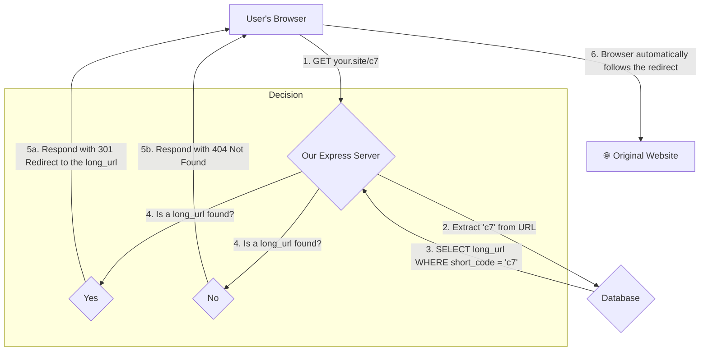
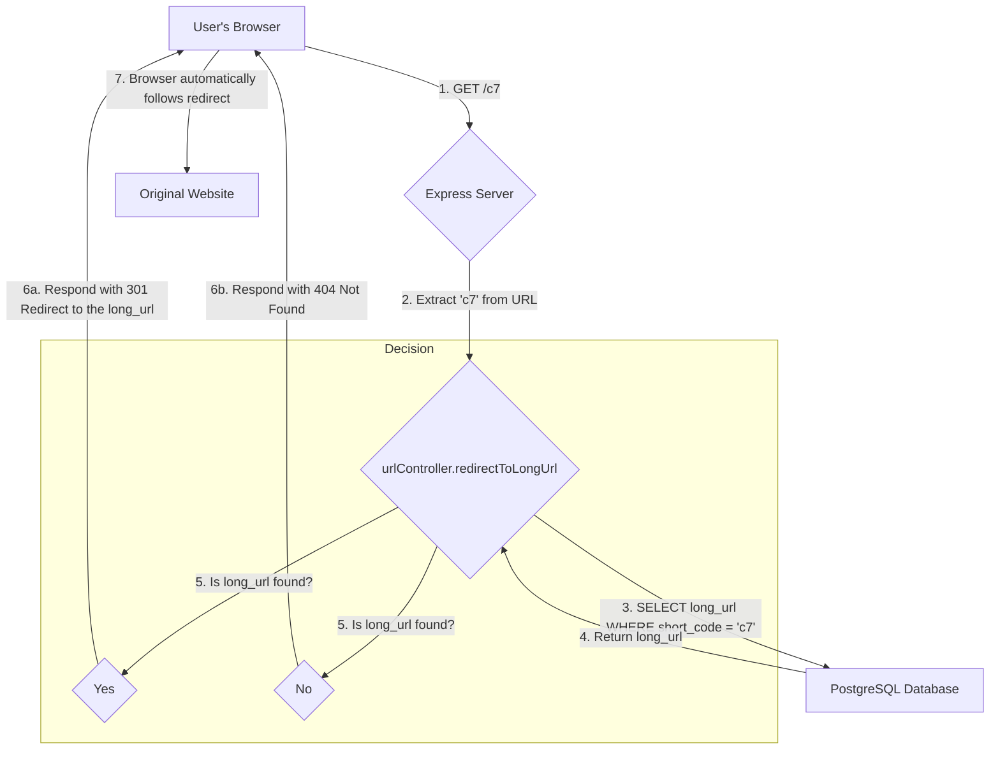

	# URL Shortener Design

This document outlines the design and final implementation of the URL shortener application.

## 1. Requirements

### 1.1. Functional Requirements

*   **Shorten a URL:** Given a long URL, the service should return a much shorter URL.
*   **Redirect:** When a user accesses a short URL, they should be redirected to the original long URL.

### 1.2. Non-Functional Requirements

*   **High Availability:** The service should be available with minimal downtime.
*   **Low Latency:** The redirection process must be extremely fast.
*   **Scalability:** The service must handle a growing number of URLs and high traffic.

## 2. High-Level Design (HLD)

### 2.1. Architecture

We implemented a monolithic application architecture using a Node.js server with the Express framework, connected to a PostgreSQL database. This provides a simple yet powerful foundation.

*   **Web Server (Express.js):** Handles incoming HTTP requests, routing them to the appropriate controllers.
*   **Application Logic (Controllers):** Contains the core logic for creating short URLs and handling redirection.
*   **Database (PostgreSQL):** Persistently stores the mapping between short codes and long URLs.

### 2.2. API Endpoints

*   `POST /api/shorten`
    *   **Description:** Accepts a long URL and returns a new, shortened URL object.
    *   **Request Body:** `{ "longUrl": "https://www.example.com/very/long/url" }`
    *   **Success Response (201 Created):** 
        ```json
        {
          "id": "1",
          "long_url": "https://www.example.com/very/long/url",
          "short_code": "b",
          "created_at": "2025-09-09T10:00:00.123Z"
        }
        ```
*   `GET /:shortCode`
    *   **Description:** Redirects the user to the original long URL associated with the `shortCode`.
    *   **Example:** A request to `http://localhost:3000/b` will issue a 301 redirect to `https://www.example.com/very/long/url`.

### 2.3. Data Model

We use a relational database model where the primary key is a unique, auto-incrementing integer (`id`). This `id` is the source for our Base-62 conversion.

*   **`id`**: `BIGSERIAL`, Primary Key. A unique number for each URL.
*   **`long_url`**: `TEXT`. The original URL.
*   **`short_code`**: `VARCHAR(10)`, Unique. The generated Base-62 code. This column is indexed for fast lookups.
*   **`created_at`**: `TIMESTAMP`. Automatically records when the entry was created.

## 3. Low-Level Design (LLD)

### 3.1. Short URL Generation

We implemented the **Base-62 Encoding** approach.

1.  A new `long_url` is inserted into the database.
2.  The database returns the unique, auto-incrementing `id` for that row.
3.  This `id` is converted into a Base-62 string (`[0-9a-zA-Z]`) to create the `short_code`.
4.  The database row is updated with the newly generated `short_code`.

This method guarantees a unique `short_code` for every URL without the risk of collisions.

### 3.2. Database Schema

The final SQL schema used to create our `urls` table and its index in PostgreSQL is:

```sql
CREATE TABLE urls (
  id BIGSERIAL PRIMARY KEY,
  long_url TEXT NOT NULL,
  short_code VARCHAR(10) UNIQUE,
  created_at TIMESTAMP WITH TIME ZONE DEFAULT CURRENT_TIMESTAMP
);

CREATE INDEX idx_urls_short_code ON urls(short_code);
```

## 4. Workflow

### Flow 1: Creating a Short URL (`POST /api/shorten`)



### Flow 2: Redirecting a Short URL (`GET /:shortCode`)

